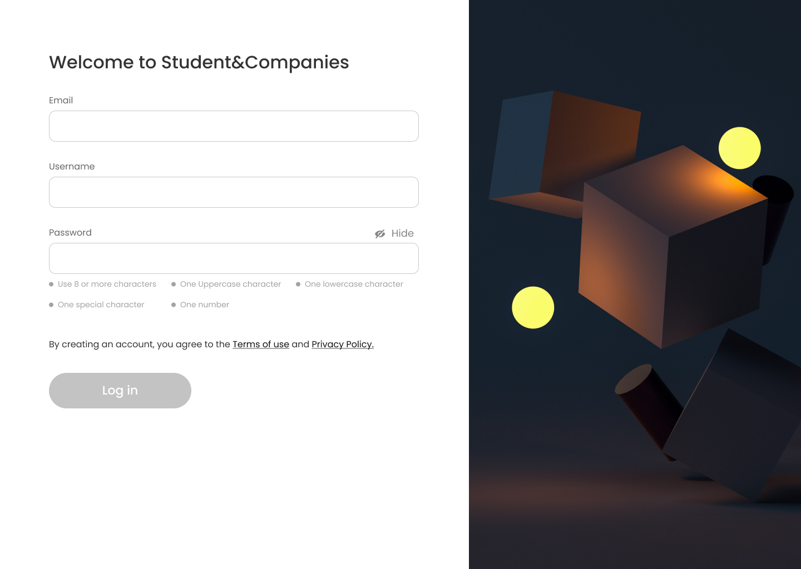

## The problem: Students&Companies

Students&Companies (S&C) is a platform that helps match university students looking for internships and companies offering them. The platform should ease the matching between students and companies based on:

* the experiences, skills and attitudes of students, as listed in their CVs;
* the projects (application domain, tasks to be performed, relevant adopted technologies -if any- etc.) and terms offered by companies (for example, some company might offer paid internships and/or provide both tangible and intangible benefits, such as training, mentorships, etc.).

The platform is used by companies to advertise the internships that they offer, and by students to look for internships. Students can be proactive when they look for internships (i.e., they initiate the process, go through the available internships, etc.). Moreover, the system also has mechanisms to inform students when an internship that might interest them becomes available and can inform companies about the availability of student CVs corresponding to their needs. We refer to this process as “recommendation”.

Recommendation in S&C can employ mechanisms of various level of sophistication to match students with internships, from simple keyword searching, to statistical analyses based on the characteristics of students and internships.
When suitable recommendations are identified and accepted by the two parties, a contact is established. After a contact is established, a selection process starts. During this process, companies interview students (and collect answers from them, possibly through structured questionnaires) to gauge their fit with the company and the internship. S&C supports this selection process by helping manage (set up, conduct, etc.) interviews and also finalize the selections. To feed statistical analysis applied during recommendation, S&C collects various kinds of information regarding the internships, for example by asking students and companies to provide feedback and
suggestions.

Moreover, S&C should be able to provide suggestions both to companies and to students regarding how to make their submissions (project descriptions for companies and CVs for students) more appealing for their counterparts. In general, S&C provides interested parties with mechanisms to keep track and monitor the execution and the outcomes of the matchmaking process and of the subsequent internships from the point of view of all interested parties. For example, it provides spaces where interested parties can complain, communicate problems, and provide information about the current status of the ongoing internship. The platform is used by students at different universities. Universities also need to monitor the situation of internships; in particular, they are responsible for handling complaints, especially ones that might require the interruption of the internship.

## Group Members
* **Russolillo Simone** simone.russolillo@mail.polimi.it 11100725
* **Valeria Benedetta Cecilia Visani** valeriabenedetta.visani@mail.polimi.it 10730247
* **Toni Wang** toni.wang@mail.polimi.it 10817365
